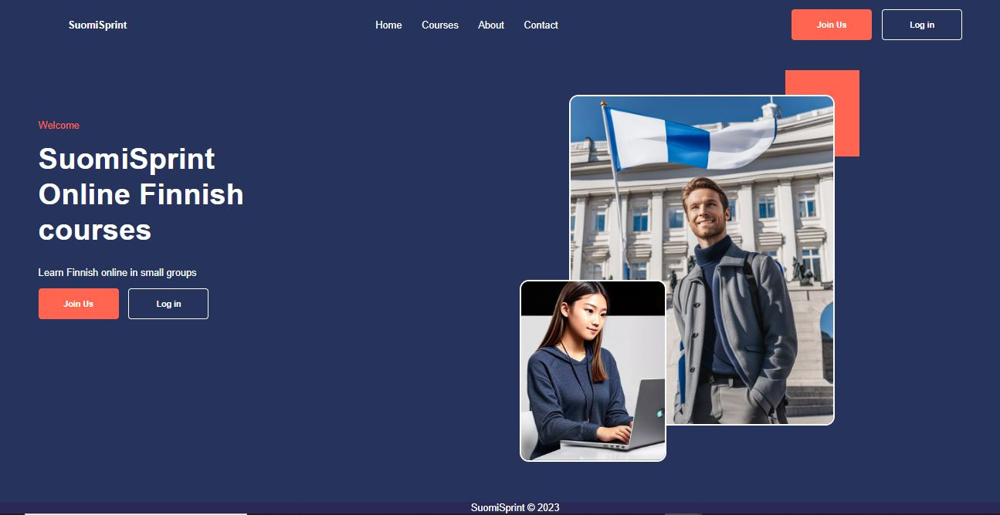
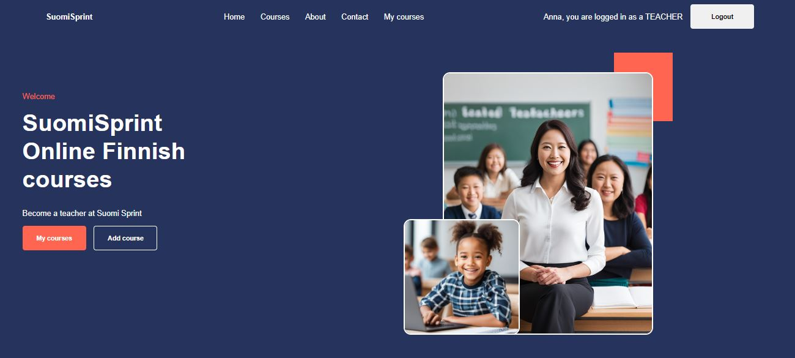
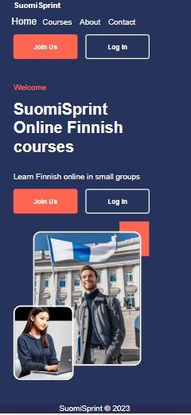
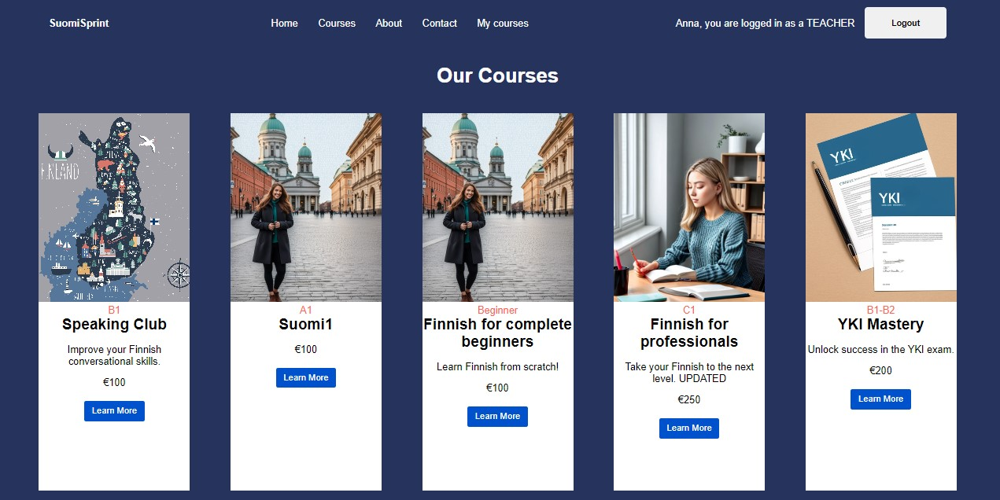

# Metropolia Project: SuomiSprint

[View the App on Render](https://suomisprint.onrender.com/)

### Authors

[Anna Linden](https://github.com/AnnaLinden), [Trang Vu](https://github.com/cindy3377), [Mamita Gurung](https://github.com/Mamita123), [Arman Yerkeshev](https://github.com/A-Yerkeshev)

## Description

This is a MERN (MongoDB, Express.js, React, Node.js) full-stack application designed for online Finnish language courses. It incorporates essential features such as authentication and authorization using JWT (JSON Web Tokens) for secure access. User passwords are securely hashed using bcrypt for data protection.

The application is hosted on Render for reliable deployment, and testing is implemented using Supertest and Jest to ensure its functionality and reliability.

<img_width = "460">
<img_height = "auto">
<img_half_width = "230">

  
   
  <em>Homepage</em> 

  
   
  <em>Teacher Interface</em>

  
   
  <em>Phone Interface</em>

  
   
  <em>Courses Page</em>

## Key Features

- **Roles:** The platform distinguishes between "teacher" and "customer" roles, catering to both course providers and students.

- **Course Management:** Course providers can effortlessly publish and manage their courses, complete with detailed descriptions and pricing information.

- **Responsive Design:** This application is designed to be responsive, ensuring a seamless experience on various screen sizes and devices.

- **User Enrollment:** Customers can explore the course offerings, enroll in the courses they are interested in, and view their enrollment status.

- **User Authentication:** Users must register and log in before enrolling in courses, ensuring secure access to course materials.

- **Course Details:** Once logged in, users can access comprehensive information about their enrolled courses, providing a seamless learning experience.

- **Course History:** The platform maintains a record of users' past course history for reference and tracking.

This application serves as a valuable platform for both Finnish language course providers and students, streamlining course management and enhancing the learning journey.

### Target users and other stakeholders:

Customers, course providers, site administrator, platform owner

### Prototype in Figma

https://www.figma.com/file/GTU2u7swBnTu49ACFexkrY/prototype?type=design&node-id=0-1&mode=design&t=YVn3P8Gfu6CJREjR-0

### User stories

_From customer’s perspective:_

Registration and Login:

- As a customer, I want to register for an account so that I can enroll in courses.

- As a customer, I want to be able to log in to view course details, my course history, and teacher contact information.

Browsing Courses:

- As a customer, I want to view a list of available courses, including names, descriptions, durations, prices, and teacher names.

- As a customer, I want to search for courses based on keywords to find the courses that suit me.

Course Details:

- As a logged-in customer, I want to access detailed information about the course I'm enrolled in, including teacher contact information.

- As a logged-in customer, I want to review the history of courses I've taken.

Enrolling in a Course:

- As a logged-in customer, I want to enroll in a course.

- As a logged-in customer, I want to receive a confirmation message upon successful enrollment.

Payment (Optional):

- As a logged-in customer, I want to make payments for courses online.

- As a logged-in customer, I want to receive a receipt upon successful payment.

Managing Enrollments:

- As a customer, I want to view a list of courses I have enrolled in.

- As a customer, I want to cancel my enrollment on a course if needed.

New Learners:

- As a new learner, I want to easily access the Home page to get a clear understanding of SuomiSprint's Finnish language learning offerings.

- As a beginner in Finnish, I want to find a prominent "Learn More" section on the Home page, explaining the curriculum and teaching methods used by SuomiSprint.

‌

Existing Students:

- As an enrolled student, I want a personalized dashboard upon login, displaying my progress, upcoming lessons, and assignments.

- As a learner nearing course completion, I want to receive recommendations for additional courses or resources that would complement my current progress.

‌

Visitors Seeking Information:

- As a potential user, I want a clear and easy-to-find link to the Pricing page to understand the cost structure of SuomiSprint's courses.

- As a visitor, I'm interested in exploring real success stories from learners who have benefited from SuomiSprint's Finnish language courses.

- As a visitor seeking more information, I want a concise overview of SuomiSprint's unique teaching methodology and what sets it apart from other language learning platforms.

- As a potential user, I want to find a dedicated "Contact Us" page with multiple channels (email, phone, chat) to reach out for personalized inquiries.

- As a visitor interested in the team behind SuomiSprint, I would like to see a brief "About Us" section that introduces the founders and their expertise in language education.

_From course provider's perspective:_

Registration and Login:

- As a course provider, I want to register for an account to list courses.

- As a course provider, I want to log in to manage course listings and view enrollments.

Managing Course Listings:

- As a course provider, I want to create new courses.

- As a course provider, I want to edit/update course details.

- As a course provider, I want to remove courses from the platform.

Viewing Enrollments:

- As a course provider, I want to see a list of customers who have enrolled in my courses.

- As a course provider, I want to view contact information for enrolled customers, if necessary.
